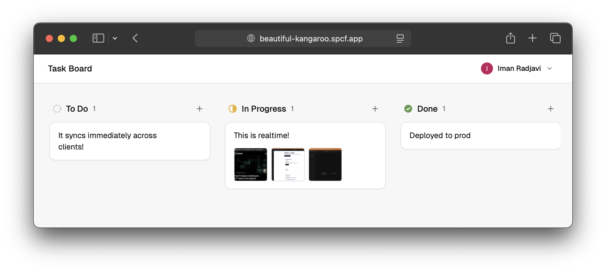
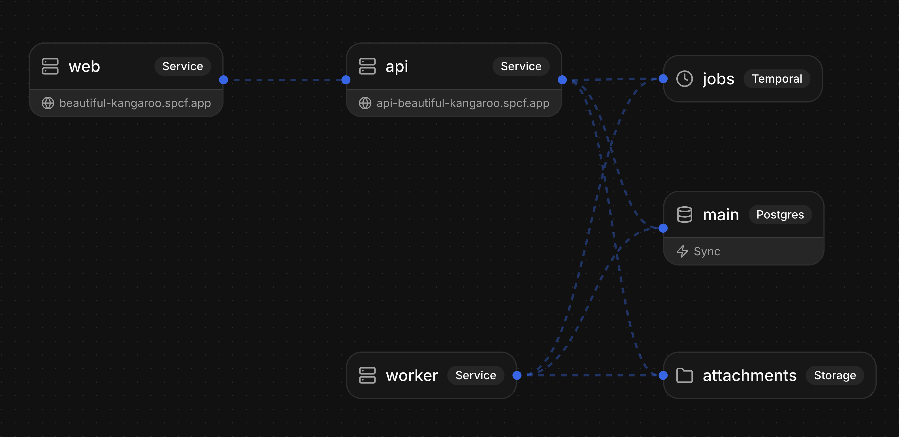

# Task Board





A collaborative task board app built with [Specific](https://specific.dev), demonstrating how to go from zero to a full-stack production app using a single infrastructure config file.

[Try the live app](https://beautiful-kangaroo.spcf.app/)

## Features

- Kanban board with drag-and-drop between columns
- Google OAuth authentication
- Real-time sync across clients via [ElectricSQL](https://electric-sql.com/)
- File attachments with S3-compatible storage
- Background thumbnail generation via [Temporal](https://temporal.io/) workflows

## Tech stack

- **Frontend:** React + Vite + Tailwind CSS + shadcn/ui
- **Backend:** Go
- **Database:** Postgres (via [Neon](https://neon.tech/)) with [Reshape](https://github.com/fabianlindfors/reshape) migrations
- **Real-time:** ElectricSQL
- **Storage:** S3-compatible ([Tigris](https://www.tigrisdata.com/))
- **Background jobs:** Temporal
- **Infrastructure:** [Specific](https://specific.dev)

## Getting started

Install the Specific CLI:

```bash
curl -fsSL https://specific.dev/install.sh | sh
```

You'll need Google OAuth credentials for authentication. Create a [Google Cloud OAuth client](https://console.cloud.google.com/apis/credentials) and have the client ID and secret ready. Specific will prompt you for them on the first run.

Start the dev environment:

```bash
specific dev
```

This starts all services (frontend, API, worker), a local Postgres database, ElectricSQL sync engine, S3-compatible storage, and a Temporal dev server.

## Project structure

```
specific.hcl          # Infrastructure config (services, database, storage, etc.)
src/                  # React frontend
api/                  # Go API server
worker/               # Go Temporal worker (thumbnail generation)
migrations/           # Reshape database migrations
```
